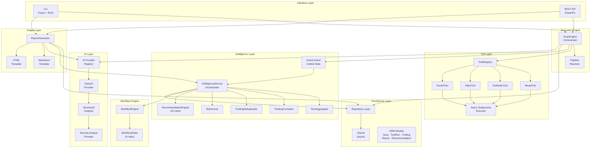
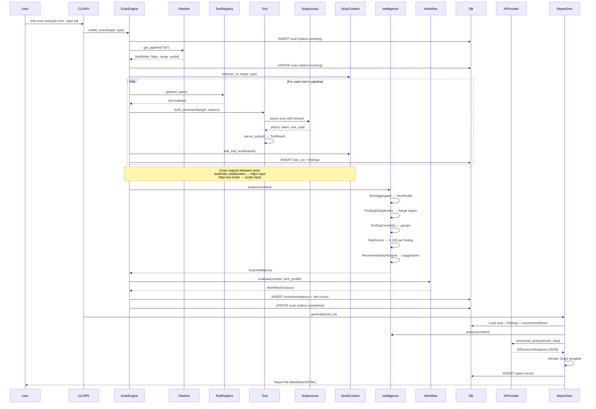
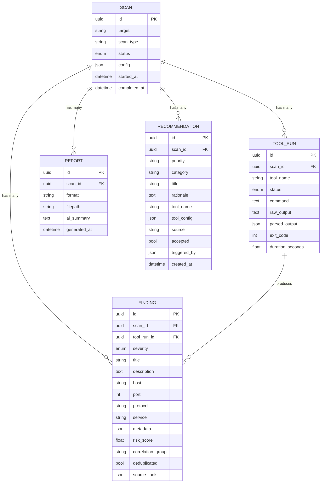

# Driln — Architecture & Documentation

> **Driln** is an intelligent automated penetration testing engine. It wraps industry-standard security tools (nmap, subfinder, httpx, nuclei) behind a unified async engine, runs an intelligence pipeline that correlates, deduplicates, and risk-scores findings, generates adaptive recommendations, and produces AI-enriched executive reports — all driven from a single CLI or REST API.

---

## What Driln Does

```
Target → Tool Pipeline → Intelligence → Recommendations → Report
```

1. **You give it a target** — a domain, host, or IP
2. **It runs a pipeline of security tools** — sequentially, chaining outputs between tools
3. **It parses raw tool output** into structured findings (severity, host, port, service)
4. **It persists everything** to a SQLite database — scans, tool runs, findings, recommendations
5. **Intelligence engine** correlates findings, deduplicates across tools, scores risk (0-100), fingerprints technology, and generates next-step recommendations
6. **Workflow engine** evaluates rules for conditional scan expansion
7. **It calls an LLM** to produce structured JSON analysis (attack paths, exploitability, remediation)
8. **It generates a report** in Markdown or HTML with findings, intelligence, and AI analysis

---

## System Architecture



---

## Directory Structure

```
driln/
├── __init__.py              # Package version (0.1.0)
├── main.py                  # FastAPI app factory + lifespan hooks
├── cli.py                   # Typer CLI (scan, serve, tools, report, intel, version)
│
├── core/
│   ├── config.py            # Pydantic Settings (DRILN_ env prefix)
│   ├── exceptions.py        # DrilnError hierarchy
│   └── logging.py           # structlog setup (JSON prod / color dev)
│
├── tools/
│   ├── base.py              # BaseTool ABC + ToolResult dataclass
│   ├── executor.py          # Async subprocess runner + semaphore concurrency
│   ├── registry.py          # ToolRegistry singleton + init_registry()
│   ├── nmap.py              # Nmap integration (XML parsing)
│   ├── subfinder.py         # Subfinder integration (JSON-lines parsing)
│   ├── httpx_tool.py        # httpx integration (JSON-lines parsing)
│   └── nuclei.py            # Nuclei integration (JSON-lines parsing)
│
├── engine/
│   ├── pipeline.py          # Predefined tool sequences (recon, vuln, full)
│   └── scanner.py           # ScanEngine — lifecycle + intelligence + workflow
│
├── intelligence/            # ← NEW: Scan intelligence layer
│   ├── __init__.py
│   ├── context.py           # ScanContext: unified scan state, built incrementally
│   ├── tech.py              # TechAggregator: merge tech from nmap/httpx/nuclei
│   ├── correlator.py        # FindingCorrelator: 3 strategies (service/chain/tech)
│   ├── dedup.py             # FindingDeduplicator: cross-tool duplicate merging
│   ├── risk.py              # RiskScorer: 4-factor composite scoring (0-100)
│   ├── recommendations.py   # RecommendationEngine: 19 declarative rules
│   └── service.py           # IntelligenceService: pipeline orchestrator
│
├── workflow/                # ← NEW: Conditional scan expansion
│   ├── __init__.py
│   ├── decisions.py         # WorkflowAction + WorkflowDecision models
│   ├── rules.py             # 6 conditional expansion rules
│   └── engine.py            # WorkflowEngine: evaluate rules → decisions
│
├── ai/
│   ├── base.py              # BaseAIProvider ABC + AIResponse + structured_analyze
│   ├── openai.py            # OpenAI-compatible provider (JSON mode + fallback)
│   ├── schemas.py           # ← NEW: Structured AI output (AIStructuredAnalysis)
│   ├── registry.py          # AI provider singleton factory
│   └── prompts.py           # System prompts + structured JSON prompt
│
├── db/
│   ├── models.py            # ORM (Scan, ToolRun, Finding, Report, Recommendation)
│   ├── engine.py            # Async engine + session factory
│   └── repos.py             # Repository CRUD (Scan, ToolRun, Finding, Report, Recommendation)
│
├── schemas/
│   ├── scans.py             # Pydantic models (ScanCreate, ScanDetail, etc.)
│   ├── findings.py          # Finding schemas
│   ├── intelligence.py      # ← NEW: TechProfile, RiskScore, CorrelationGroup, ScanIntelligence
│   ├── reports.py           # Report request schema
│   └── tools.py             # Tool info schemas
│
├── api/
│   ├── deps.py              # FastAPI dependency injection
│   ├── health.py            # GET /health
│   └── v1/
│       ├── router.py        # Aggregate v1 router
│       ├── scans.py         # POST/GET /api/v1/scans
│       ├── tools.py         # GET /api/v1/tools
│       ├── reports.py       # POST /api/v1/reports/{scan_id}
│       └── intelligence.py  # ← NEW: Intelligence + recommendation endpoints
│
└── reports/
    ├── generator.py         # ReportGenerator (data + intelligence + AI + Jinja2)
    └── templates/
        ├── markdown.md.j2   # Markdown report template
        └── html.html.j2     # Dark-themed HTML report template
```

---

## Data Flow — Full Scan Lifecycle



---

## Key Systems in Detail

### Tool Abstraction

Every tool implements `BaseTool` with two methods:

| Method | Purpose |
|---|---|
| `build_command(target, options)` | Returns the CLI command as `list[str]` |
| `parse_output(raw_output, exit_code)` | Parses stdout into a structured `ToolResult` |

The base class provides `run()` (async execution) and `check_installed()` for free. Adding a new tool = one file.

### Scan Pipelines

Three built-in pipelines determine which tools run and in what order:

| Pipeline | Tools | Use Case |
|---|---|---|
| `recon` | subfinder → httpx → nmap | Reconnaissance / asset discovery |
| `vuln` | nmap → nuclei | Vulnerability scanning |
| `full` | subfinder → httpx → nmap → nuclei | Complete penetration test |

### Output Chaining

The ScanEngine intelligently chains tool outputs:

- **subfinder** discovers subdomains → writes to file → **httpx** reads as input list
- **httpx** probes live hosts → writes URLs to file → **nuclei** reads as input list

---

### Intelligence Layer

The intelligence pipeline runs after all tools complete (and incrementally during scan execution). It processes findings through five stages:

#### 1. Technology Aggregation (`TechAggregator`)

Merges technology detections from all tools into a unified `TechProfile`:

| Source | What it extracts |
|---|---|
| nmap | `product`/`version` from service probes |
| httpx | `tech` array, `webserver` header |
| nuclei | Template tags (`wordpress`, `nginx`, etc.) |

Technologies are deduplicated across sources with confidence boosting (seen by 2+ tools = higher confidence).

**93 technologies** mapped across 10 categories: cms, server, framework, language, cdn, waf, database, os, library, other.

#### 2. Finding Deduplication (`FindingDeduplicator`)

When multiple tools report the same issue (e.g., nmap and nuclei both flag an open port), findings are merged:

- **Match criteria**: Same host + same port + different tools + title similarity ≥ 70%
- **Primary selection**: Higher severity wins, then longer description
- **Result**: Single finding with `source_tools: ["nmap", "nuclei"]`

#### 3. Finding Correlation (`FindingCorrelator`)

Groups related findings using three strategies:

| Strategy | Logic | Example |
|---|---|---|
| `same_service` | Multiple tools, same host:port | nmap + nuclei on port 443 |
| `attack_chain` | Info/low + medium/high on same service | Version disclosure + known CVE |
| `tech_overlap` | Findings mentioning same detected tech | Multiple WordPress findings |

#### 4. Risk Scoring (`RiskScorer`)

Each finding gets a **composite 0-100 risk score** from four weighted factors:

| Factor | Weight | How |
|---|---|---|
| Base severity | 40% | Maps `critical=1.0`, `high=0.8`, `medium=0.5`, `low=0.2`, `info=0.05` |
| Exploitability | 25% | Keyword heuristic: "rce", "injection", "unauthenticated" → 0.9 |
| Exposure | 20% | Internet-facing services (HTTP, SSH, FTP) → 0.8, well-known ports → 0.7 |
| Context boost | 15% | Multiple findings on same service, large attack surface, known tech |

**Scan-level score**: Top-heavy weighted average (top 20% findings get 3× weight).

**Score labels**: ≥80 critical, ≥60 high, ≥40 medium, ≥20 low, <20 informational.

#### 5. Recommendation Engine (`RecommendationEngine`)

**19 declarative rules** generate next-step suggestions:

| Category | Rules | Examples |
|---|---|---|
| CMS | 3 | WordPress → WPScan, Joomla → JoomScan, Drupal → Droopescan |
| Protocol | 5 | SMB → enum4linux, FTP → anon check, SSH → ssh-audit, SNMP → snmpwalk, RDP → BlueKeep |
| Database | 4 | MySQL/Postgres/MongoDB/Redis exposed → verify auth |
| Finding-based | 4 | Admin panel → credential check, .git → dump, SSL → testssl, CORS → verify |
| Infrastructure | 3 | Jenkins → nuclei templates, Docker API → check, GraphQL → cop |

Each recommendation has: `priority`, `category`, `title`, `rationale`, optional `tool_name` and `tool_config`, and `source` ("rule_engine" or "ai_analysis").

---

### Workflow Engine

Evaluates **6 conditional scan expansion rules** after intelligence analysis:

| Rule | Condition | Action | Auto? |
|---|---|---|---|
| `wordpress_expand` | WordPress in tech profile | Add WP nuclei templates | ❌ |
| `admin_panel_brute` | Login/admin panel in findings | Add default-login templates | ❌ |
| `exposed_database_deep` | Port 3306/5432/27017/6379 open | Add database nuclei templates | ✅ |
| `many_subdomains_expand` | 20+ hosts discovered | Notify: run targeted nmap | ❌ |
| `jenkins_unauthenticated` | Jenkins in tech profile | Add Jenkins templates | ❌ |
| `git_exposed_dump` | .git in findings | Notify: secrets extractable | ❌ |

**Assisted mode**: Actions require user approval unless marked auto-run (only `exposed_database_deep` auto-runs due to critical severity).

---

### AI Analysis

The AI system supports two modes:

#### Prose Analysis (Phase 1)
Free-form security analyst output: executive summary, risk assessment, remediation.

#### Structured Analysis (Phase 2)
Machine-readable JSON output validated against `AIStructuredAnalysis` Pydantic schema:

```json
{
  "executive_summary": "...",
  "overall_risk": "high",
  "risk_score": 72,
  "critical_findings": [{ "finding_title": "...", "exploitability": "trivial", ... }],
  "attack_paths": [{ "name": "...", "steps": [...], "likelihood": "high", ... }],
  "recommendations": [{ "priority": "critical", "title": "...", ... }],
  "false_positive_flags": ["..."],
  "quick_wins": ["..."]
}
```

**Extraction strategy** (3-tier fallback):

1. `response_format: {"type": "json_object"}` — native OpenAI JSON mode
2. Prompt engineering + regex JSON extraction from markdown fences
3. Wrap prose analysis in minimal structured envelope

Works with any OpenAI-compatible API: GPT-4, Ollama, vLLM, LM Studio, OpenRouter.

---

### Database Schema



### Exception Hierarchy

```
DrilnError (base)
├── ToolError
│   ├── ToolNotFoundError      # Binary not in PATH
│   ├── ToolTimeoutError       # Exceeded timeout
│   └── ToolExecutionError     # Non-zero exit / crash
├── AIProviderError
│   ├── AIConnectionError      # Can't reach endpoint
│   └── AIResponseError        # Bad/malformed response
├── ScanError                  # Scan lifecycle errors
└── ConfigError                # Invalid/missing config
```

---

## Configuration

All settings are loaded from environment variables with the `DRILN_` prefix:

| Variable | Default | Description |
|---|---|---|
| `DRILN_DEBUG` | `false` | Enable debug logging (color console) |
| `DRILN_LOG_LEVEL` | `INFO` | Log level |
| `DRILN_DATABASE_URL` | `sqlite+aiosqlite:///./driln.db` | Database connection string |
| `DRILN_AI_PROVIDER` | `openai` | AI backend |
| `DRILN_AI_MODEL` | `gpt-4o` | Model to use |
| `DRILN_AI_API_KEY` | — | API key (required for AI features) |
| `DRILN_AI_BASE_URL` | `https://api.openai.com/v1` | Custom endpoint for local models |
| `DRILN_AI_TEMPERATURE` | `0.2` | LLM temperature |
| `DRILN_AI_MAX_TOKENS` | `4096` | Max response tokens |
| `DRILN_SCAN_TIMEOUT` | `300` | Per-tool timeout (seconds) |
| `DRILN_SCAN_MAX_CONCURRENT` | `3` | Max parallel tool executions |
| `DRILN_SCAN_OUTPUT_DIR` | `./output` | Where reports and artifacts are saved |
| `DRILN_TOOLS_ENABLED` | `["nmap","subfinder","httpx","nuclei"]` | Which tools to register |

---

## CLI Reference

```bash
# Scanning
driln scan <target> --type full         # Run a penetration test
driln scan <target> --tools nmap        # Run specific tools only
driln scan <target> --no-ai             # Skip AI analysis

# Tools
driln tools list                        # Show all tools + install status
driln tools check                       # Verify tool installations

# Reports
driln report <scan-id> --format html    # Generate report for a scan
driln report <scan-id> --no-ai          # Report without AI summary

# Intelligence
driln intel summary <scan-id>           # Full intelligence report (risk, tech, correlations)
driln intel recommendations <scan-id>   # List next-step recommendations with status
driln intel tech <scan-id>              # Technology fingerprint profile

# Server
driln serve --port 8000                 # Start the REST API
driln serve --reload                    # Dev mode with hot reload

# Meta
driln version                           # Show version
```

## API Reference

| Method | Endpoint | Description |
|---|---|---|
| `GET` | `/health` | Health check |
| `POST` | `/api/v1/scans` | Create + start a scan (background task) |
| `GET` | `/api/v1/scans` | List all scans with pagination |
| `GET` | `/api/v1/scans/{id}` | Full scan details + findings |
| `POST` | `/api/v1/scans/{id}/cancel` | Cancel a running scan |
| `GET` | `/api/v1/scans/{id}/intelligence` | Full intelligence report (tech, risk, correlations, recommendations) |
| `GET` | `/api/v1/scans/{id}/recommendations` | List recommendations for a scan |
| `POST` | `/api/v1/scans/{id}/recommendations/{rid}/accept` | Accept a recommendation |
| `POST` | `/api/v1/scans/{id}/recommendations/{rid}/dismiss` | Dismiss a recommendation |
| `GET` | `/api/v1/tools` | List registered tools |
| `GET` | `/api/v1/tools/{name}/check` | Check if a tool is installed |
| `POST` | `/api/v1/reports/{scan_id}` | Generate a report |
| `GET` | `/docs` | Interactive Swagger UI |

---

## Intelligence Pipeline — Deep Dive

### How ScanContext Works

`ScanContext` is the living document of scan intelligence. It's built **incrementally** — after each tool completes, the scanner calls `add_tool_result()` which:

1. Tags findings with `tool_name` (for dedup cross-tool detection)
2. Dispatches to tool-specific ingestion (`_ingest_nmap`, `_ingest_httpx`, etc.)
3. Populates `hosts`, `services`, and `_raw_techs` dictionaries

No intelligence component queries the DB directly — they all read from `ScanContext`.

### Recommendation Lifecycle

```
Rule fires → Recommendation created (source="rule_engine", accepted=None)
                    │
                    ├── User accepts → accepted=True (via CLI or API)
                    └── User dismisses → accepted=False
```

AI-generated recommendations follow the same flow but with `source="ai_analysis"`.

### Risk Score Interpretation

| Score | Label | Meaning |
|---|---|---|
| 80-100 | Critical | Imminent compromise risk, immediate action required |
| 60-79 | High | Significant vulnerabilities, prioritize remediation |
| 40-59 | Medium | Notable issues, plan remediation |
| 20-39 | Low | Minor concerns, monitor |
| 0-19 | Informational | No significant risk |

---

## Tech Stack

| Layer | Technology |
|---|---|
| Language | Python 3.12+ |
| CLI | Typer + Rich |
| API | FastAPI + Uvicorn |
| ORM | SQLAlchemy 2.0 (async) |
| Database | SQLite (aiosqlite) |
| AI | httpx → OpenAI-compatible API |
| Validation | Pydantic v2 |
| Logging | structlog (JSON prod / color dev) |
| Templates | Jinja2 |
| Testing | pytest + pytest-asyncio |
| Linting | Ruff + mypy |

---

## Design Principles

1. **Modular monolith** — clear package boundaries, no microservices
2. **Async-first** — all I/O is async (DB, HTTP, subprocess)
3. **AI is optional** — intelligence layer works without AI; LLM adds enrichment, doesn't gatekeep
4. **Explainable** — every recommendation has a `rationale`; every risk score shows its factor breakdown
5. **Assisted, not autonomous** — workflow suggests actions, user approves (except critical auto-rules)
6. **Tool-agnostic** — adding a tool = one file implementing `BaseTool`
7. **Provider-agnostic** — any OpenAI-compatible API (local or cloud)

---

## License

MIT
